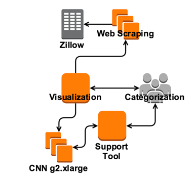

## Process

* Check list of prices for EC2 Spot instances g2.2xlarge
* Start a spot instance in a certain region for _x_ hours (days)
* Use Ansible to connect to system and run Cafe
  * Get logs from system
  * Run python script to get filters for a snapshot
* Get filter and logs from system
* Visualize results in iPython notebook
* Shutdown instance

* Generate test, train and CV data
  * Connect to zillow and get info
  * Categorize using webapp
  * Output in a format for Cafe

## References

* [Excellent Introduction to CNN](https://www.youtube.com/watch?v=bEUX_56Lojc)
* [Deeper Tutorial on CNN](http://cs231n.github.io/convolutional-networks/)
* [Caffe Layers](http://caffe.berkeleyvision.org/tutorial/layers.html)
* [Caffe MNIST Tutorial](http://caffe.berkeleyvision.org/gathered/examples/mnist.html)
* [Applications of Convolutions](https://en.wikipedia.org/wiki/Convolution#Applications)
* [Complexities of Convolutions](https://github.com/Yangqing/caffe/wiki/Convolution-in-Caffe:-a-memo)
* [MXNet Distributed Deep Learning](https://github.com/dmlc/mxnet)
* [RNN Introduction](http://www.wildml.com/2015/09/recurrent-neural-networks-tutorial-part-1-introduction-to-rnns/)
* [Chainer Deep Learning Framework](http://chainer.org/)
